<p align="center"></p>

# glia

[English](README.md) · **Русский** · [Документация](https://denisdrobyshev.github.io/glia/)

**Минималистичная «прозрачная» (glass-box) библиотека для создания LLM-агентов.**
Каждый вызов модели, каждый вызов инструмента и каждое изменение состояния —
обычный объект, который можно залогировать, сохранить в снапшот и воспроизвести.
Никакого скрытого потока управления. Весь цикл помещается в один файл, который
читается за вечер.

> _glia_ (глия) — клетки, которые поддерживают и связывают нейроны. Это
> «соединительная ткань» для LLM-агентов: не фреймворк, которому вы
> подчиняетесь, а небольшая библиотека, поверх которой вы строите.

[](https://github.com/DrobyshevDev/glia/actions/workflows/ci.yml)
&nbsp;Python 3.10+ &nbsp;·&nbsp; MIT &nbsp;·&nbsp; ядро без зависимостей &nbsp;·&nbsp; типизировано

<p align="center">
  
  <br><sub>Десктоп-оболочка — стриминг ответа слева, живой «стеклянный ящик» справа. <i>(Анимированный SVG; проигрывается в браузере.)</i></sub>
</p>

---

## Зачем ещё одна библиотека для агентов?

Рынок агентных фреймворков в 2026 году перегружен, и самая громкая претензия к
существующим решениям одна и та же: **слишком много абстракций, скрытый поток
управления, тяжело отлаживать.** Разработчики раз за разом выкидывают фреймворк
и обращаются к API модели напрямую — просто чтобы видеть, что происходит.

glia делает ставку на обратное. Современные техники — инструменты,
структурированный вывод, стриминг, параллельный запуск инструментов, компакция
контекста, устойчивые чек-пойнты, guardrails, human-in-the-loop подтверждение,
сабагенты, «эвалы как тесты» — поставляются как **опциональные примитивы,
которые можно прочитать**, а не как монолит, которому приходится доверять. Цель —
понятность и контроль, а не количество фич.

Нужен движок графов — берите [LangGraph](https://github.com/langchain-ai/langgraph).
Нужны ролевые «команды» — берите [CrewAI](https://github.com/crewAIInc/crewAI).
Нужен небольшой прозрачный цикл, который вы полностью понимаете, — берите glia.

Подробный анализ рынка — в [docs/STRATEGY.md](docs/STRATEGY.md).

## Установка

```bash
pip install glia-agents               # ядро — без зависимостей
pip install "glia-agents[anthropic]"  # + провайдер Claude
```

> Пакет называется `glia-agents` (имя `glia` было занято в PyPI); импорт всегда
> `import glia`.

## Тур за 30 секунд

```python
import asyncio
from glia import Agent, tool
from glia.providers import ClaudeLLM

@tool
async def get_weather(city: str) -> str:
    """Узнать текущую погоду в городе."""
    return {"Paris": "18°C, облачно"}.get(city, "неизвестно")

async def main():
    agent = Agent(ClaudeLLM(), tools=[get_weather], system="Отвечай кратко.")
    result = await agent.run("Какая погода в Париже?")
    print(result.output)   # ответ
    print(result.usage)    # во сколько обошлось

asyncio.run(main())
```

Нет ключа API? Все примеры работают офлайн с детерминированным провайдером
`EchoLLM` — тот же код, без сети:

```python
from glia.providers import EchoLLM, call
llm = EchoLLM([call("get_weather", {"city": "Paris"}), "В Париже 18°C, облачно."])
```

## Смотрите весь «стеклянный ящик»

Поскольку цикл порождает событие на каждое действие, за его работой можно
наблюдать:

```python
async for event in agent.run_events("Какая погода в Париже?"):
    print(event.kind)
# run_started → model_call → model_response → tool_called → tool_returned → ... → run_finished
```

А всё состояние запуска — один сериализуемый объект:

```python
from glia.checkpoint import save, load
save(result.trajectory, "run.json")     # устойчивое выполнение: это просто JSON
resumed = load("run.json")
await agent.run("уточняющий вопрос", trajectory=resumed)   # продолжит с места остановки
```

## Что внутри

| Примитив | Что даёт |
|---|---|
| **Прозрачный цикл** | `agent.run()` / `agent.run_events()` — без скрытого потока управления |
| **Стриминг** | `Agent(..., stream=True)` — токены приходят как события `ModelDelta` |
| **Типизированные инструменты** | `@tool` на обычной функции; JSON-схема из аннотаций типов |
| **Параллельные инструменты** | вызовы за один ход выполняются параллельно, порядок результатов сохранён |
| **Шлюз подтверждения** | `approval=...` — проверяемый human-in-the-loop вердикт перед запуском инструмента |
| **Граница провайдера** | один протокол `LLM` (~40 строк); адаптеры Claude, OpenAI, локальные (Ollama) и офлайн |
| **Инструменты MCP** | инструменты любого MCP-сервера как инструменты glia (extra `[mcp]`) |
| **Trajectory** | полное, сериализуемое в JSON состояние запуска и лог событий |
| **Структурированный вывод** | `generate_structured(...)` → dataclass / модель Pydantic / dict |
| **Инженерия контекста** | `SummarizingCompactor`, `TrimmingCompactor` |
| **Устойчивое выполнение** | чек-пойнт и возобновление — запуск это JSON-файл |
| **Guardrails** | валидаторы `(text) -> None` для входа и выхода |
| **Сабагенты** | `agent.as_tool(...)` — любой агент становится инструментом |
| **Эвалы как тесты** | регрессионный набор в стиле pytest для поведения агента |
| **Запись и воспроизведение** | записать ответы реального провайдера один раз, воспроизводить офлайн (в стиле VCR) |
| **OpenTelemetry** | hook `OTelExporter` превращает поток событий в спаны (extra `[otel]`) |

## Примеры

Запускаемые, офлайн, без ключа API:

```bash
python examples/01_hello_agent.py            # базовый агент + поток событий
python examples/02_tools.py                  # инструменты
python examples/03_structured_output.py      # типизированный вывод
python examples/04_subagents.py              # сабагент как инструмент
python examples/05_checkpoint_resume.py      # устойчивое выполнение
python examples/06_evals.py                  # набор эвалов
python examples/07_streaming_and_approval.py # стриминг + параллельные инструменты + подтверждение
python examples/08_ollama_local.py           # локальная модель (Qwen/DeepSeek) через Ollama
python examples/09_record_replay.py          # записать один раз, воспроизводить офлайн
```

## Десктоп-приложение

В комплекте с glia идёт **графическая оболочка** — окно чата, которое ещё и
показывает «стеклянный ящик» в реальном времени (стриминг токенов, вызовы
инструментов, подтверждения).

- **Скачайте** готовую сборку под вашу ОС из [последнего релиза](https://github.com/DrobyshevDev/glia/releases/latest) (`glia-shell-windows.exe` / `-macos` / `-linux`) — Python не нужен.
- **Или** `pip install "glia-agents[shell]"` и затем `glia-shell` для нативного окна.

Работает офлайн в demo-режиме из коробки; добавьте Anthropic API-ключ в
настройках, чтобы общаться с настоящим Claude. Всё приложение — стандартная
библиотека + один HTML-файл, см. [docs/app.md](docs/app.md).

## Документация

- **[Сайт документации](https://denisdrobyshev.github.io/glia/)** — полное руководство на **English** и **Русском**
- [Стратегия и анализ рынка](docs/STRATEGY.md) — зачем glia и с кем конкурирует
- [Архитектура](docs/ARCHITECTURE.md) — как всё устроено
- [Дорожная карта](docs/ROADMAP.md) — куда движемся
- [Как участвовать](CONTRIBUTING.md)

## Статус

**v0.8 — alpha.** Основная идея подтверждена от начала до конца полным набором
тестов (167 офлайн-тестов, покрытие ~95%) и зелёным CI (ruff + **mypy** + тесты).
v0.8 — редизайн десктоп-оболочки в современное приложение с несколькими чатами
(сайдбар с историей, рендер Markdown/кода, переключатель темы); v0.7 — экспортёр
OpenTelemetry; v0.6 — кассеты; v0.5 — OpenAI + подтверждение + MCP; v0.4 —
локальные модели через Ollama; v0.3 — десктоп-оболочку; v0.2 — стриминг,
параллельные инструменты и подтверждение. API ещё может меняться до 1.0.
Обратная связь и issues приветствуются.

## Лицензия

MIT — см. [LICENSE](LICENSE).
